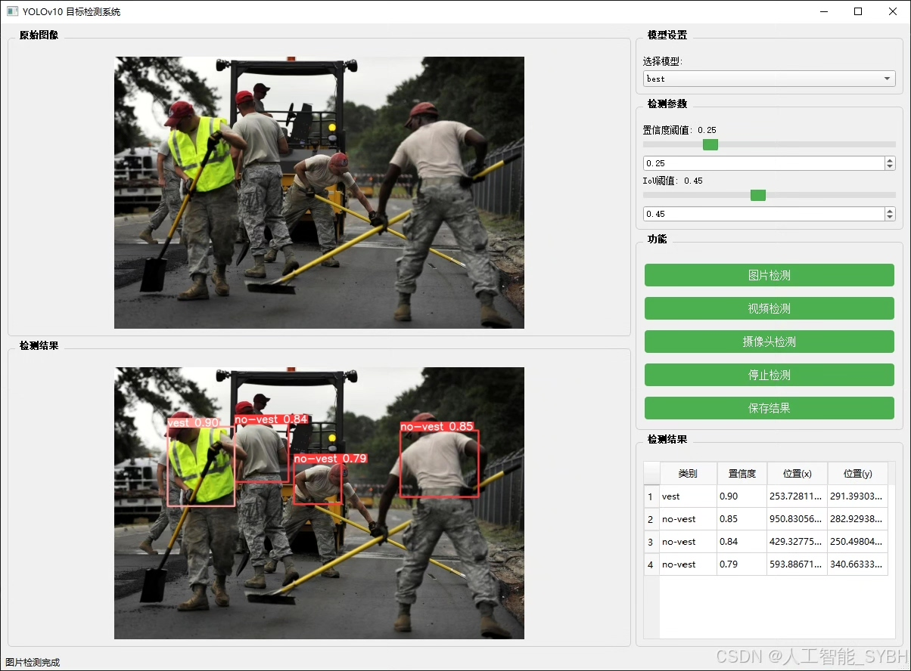
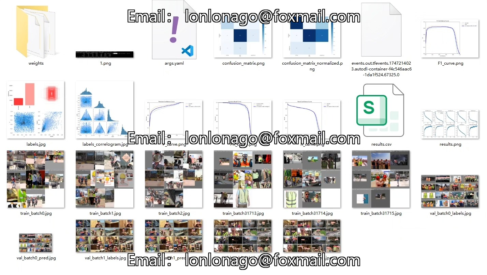
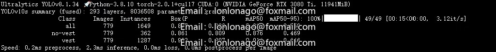
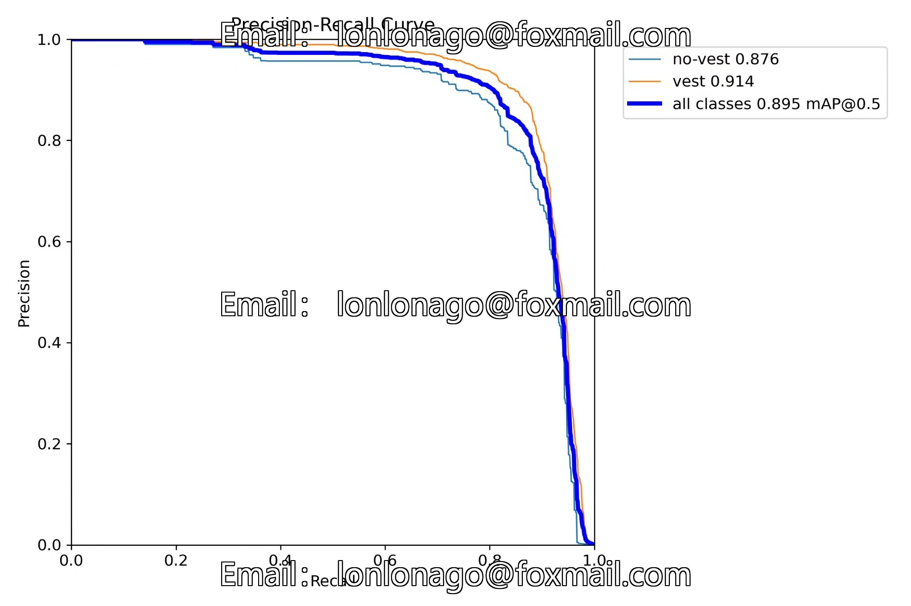
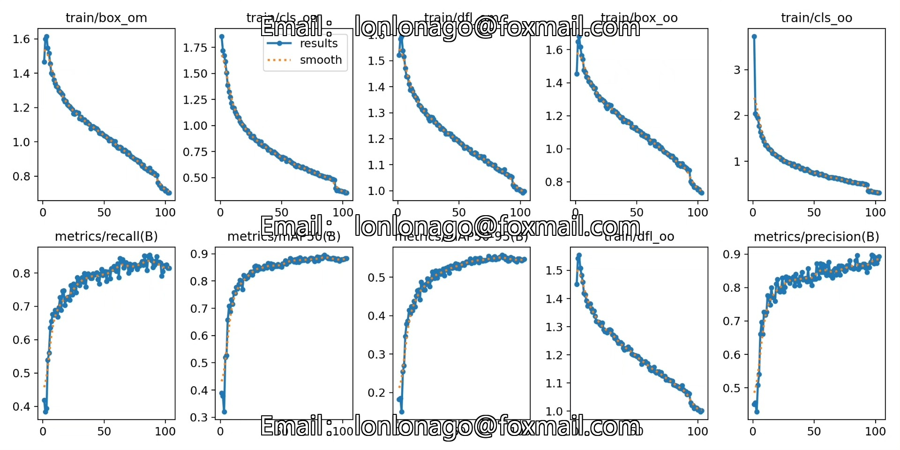
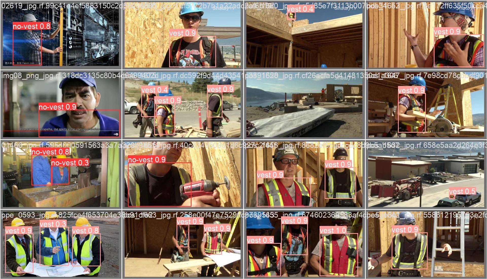

# Based on deep learning YOLOv10, a security vest wearing recognition detection system for YOL

## Body

Based on the YOLOv10 object detection algorithm, a safety vest wearing recognition detection system has been developed. This project is specifically designed to identify whether workers are wearing safety vests as required. The system includes two detection categories: "vest" (wearing safety vest) and "no-vest" (not wearing safety vest). The project uses a custom dataset for training, which contains 2728 images in the training set, 779 images in the validation set, and 390 images in the test set, totaling 3897 labeled images. This system can be widely applied in high-risk work environments such as construction sites, mining areas, and traffic control where mandatory safety vests must be worn. It can automatically detect compliance with clothing requirements through real-time video surveillance, significantly improving safety management efficiency and reducing the risk of accidents caused by unprotected equipment.

The company's products have obtained YOLO official commercial license certification.

We provide after-sales service.

After payment, we will provide WeChat ID for any questions.

Environmental configuration: We will provide an instructional tutorial for setting up the environment, and WeChat will provide answers to questions.

Remote installation service: If you need remote configuration, an additional fee of 69 is charged,
if the configuration fails, all fees will be refunded (only the installation fee is refunded for older computers).

Retraining dataset: After setting up the environment, you can train on your own computer.
If you need us to retrain, just pay 69 plus computing power fees (2.5 yuan/hour).

Full after-sales service

## Images

## Payment

Here is a pay link on Stripe ( https://buy.stripe.com/3cs8yP7sY87d0vu9AB ). Please contact me lonlonago@foxmail.com after funding $89, and I will send you a complete data files , thank you!

